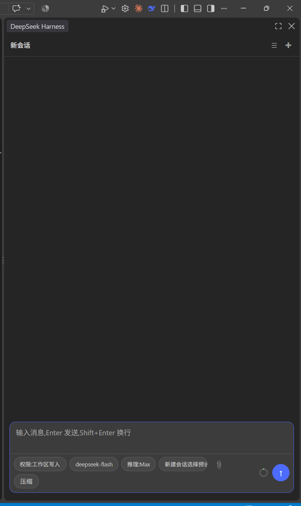

# DSH Sidebar

[English](README.md) | **简体中文** · [更新日志](CHANGELOG.md) · [下载安装包](https://github.com/moxingovo/dsh-sidebar/releases)

在 VS Code 内提供 **Claude Code 风格的原生 DSH 侧边栏**:自写原生前端
(无 iframe),复用本机已有的 dsh web 服务(默认 127.0.0.1:3080)与 `~/.dsh`,
不引入第二个 Gateway、不修改服务端。

> 非官方社区扩展,与 DeepSeek 无关。

<p align="center"><a href="media/demo-panel.png"></a></p>

<sub>看不到截图?多半是网络访问不了 <code>raw.githubusercontent.com</code> —— 直接打开 <a href="media/demo-panel.png">media/demo-panel.png</a>,或用 <a href="https://cdn.jsdelivr.net/gh/moxingovo/dsh-sidebar@main/media/demo-panel.png">jsDelivr 镜像</a>。</sub>

- **界面(Claude Code 风格)**:顶栏左侧是**当前对话的名字**,右侧只有会话列表与新建会话两个圆钮;底部功能区整块一圈 DeepSeek 蓝描边,输入区与工具行之间一条分隔线,药丸/发送键/占用环同比放大。
- **空白会话与草稿**:新建对话没发消息就切走,它不会占着列表;在里面打了字则会被留下(草稿按会话记账,切回来原样还在,也不会串到别的会话),下次点"新建"优先复用那个空会话而不是再造一个。
- **入口(与 Claude Code 一致)**:右上角辅助栏的 **DeepSeek Harness 图标**(DeepSeek 蓝)——点击即调起右侧对话面板;状态栏左侧 **DSH** 显示服务状态并可开关;快捷键 `Ctrl+Alt+D`。
- **会话**:仅显示当前工作区的会话,可新建/切换/归档/重命名/fork;上下文用量条为服务端真实 token 数据。
- **模型/预设**:模型与推理档位下拉;预设仅在空白会话可切换(会话开始后锁定,服务端约束)。
- **能力**:流式回复、停止、工具卡/审批卡/Todo/时间线、图片附件(vision)、`/compact` 压缩、Markdown+代码块。
- **协议**:0.1.6 Typert 网关 —— `POST /api/<ns>/<method>`(命名参数)+ 一条 `/api/remote.mux` WebSocket 承载全部流(session follow、workspace 基线、`$events`),详见 [docs/protocol.md](docs/protocol.md)。

## 安装

从 .vsix 安装:

```
code --install-extension dsh-webview-0.6.2.vsix
```

或自行打包(仓库根目录):

```
npx @vscode/vsce package
pwsh -File test\fix-vsix.ps1   # 修复 vsce 对 package.json 中文的编码损坏
code --install-extension dsh-webview-0.6.2.vsix
```

> ⚠️ 已知:某些 Windows 环境下 `vsce package` 会把 package.json 的 UTF-8 中文
> 转成 GBK 乱码甚至破坏 JSON。打包后务必运行 `test\fix-vsix.ps1` 重建工件。

## 零配置启动

默认:先探测 `dshWeb.port`(默认 3080)上是否已有 dsh 实例——有就 attach
(复用现有会话);没有就自动启动一个(顺序:`dshWeb.command` → `dshWeb.checkout` →
PATH 里的 `dsh` CLI → `npx @deepseek-ai/dsh`)。服务器以 **cwd = 当前工作区第一个文件夹**
运行,`DSH_HOME` 强制为 `~/.dsh`(与 attach 完全一致,绝不隔离)。

## 设置

| 设置 | 默认 | 说明 |
|---|---|---|
| `dshWeb.port` | 3080 | 附着/启动的端口 |
| `dshWeb.attachExisting` | true | 优先复用已运行的实例 |
| `dshWeb.spawnIfMissing` | true | 没有实例时自动启动 |
| `dshWeb.checkout` | 空 | 可选:checkout 路径(用其 apps/cli/lib/bin.js 启动) |
| `dshWeb.command` | 空 | 整条启动命令覆盖(如 `pnpm dsh`) |
| `dshWeb.extraArgs` | [] | 追加参数(如 `--trusted-host`) |
| `dshWeb.attachWaitSeconds` | 30 | 端口没服务时,先等这么久再自启(给受管启动器留重启窗口) |
| `dshWeb.takeoverAfterSeconds` | 45 | 附着服务连续无响应这么久才接管自启 |
| `dshWeb.nodeMaxOldSpaceMb` | 8192 | 自启 node 的 `--max-old-space-size`(0 = Node 默认) |
| `dshWeb.nodeArgs` | [] | 追加给 node 可执行文件本身的参数(checkout 启动器) |
| `dshWeb.followWorkspace` | true | 自启服务器跟随工作区首文件夹变化重启 |
| `dshWeb.stopOnExit` | true | 退出 VS Code 时停掉本扩展启动的服务器 |

排错看 **Output → DSH** 频道(记录连接与协议流量)。

## 排障:右上角图标不显示 / "聊天"标签去不掉

两个独立根因,均已内置一键修复(`fix-dsh.cmd` 按顺序执行):

### 根因 1:扩展扫描缓存指向已删除的旧版本目录

VS Code 把扩展扫描结果缓存在 `.vscode\extensions\extensions.json`。若安装新版本时
直接删除了旧版本目录,VS Code 启动时仍按缓存找旧目录 → ENOENT → 把扩展标记为
"损坏",**同目录下的新版本永远不会被发现**(图标因此不出现)。

修复:`test\fix-cache.js` —— 把缓存条目更新为新版本路径、清除档案级扫描缓存
(强制全量重扫)、修正 placeholder 图标路径。备份自动生成。

### 根因 2:辅助栏容器图标/聊天标签驻留在全局存储

VS Code 1.136 把辅助栏容器图标(标题栏/右缘图标条)存在**全局存储**
`workbench.auxiliarybar.pinnedPanels`,聊天标签的常驻状态也在那里;仅改工作区状态无效,
且 VS Code 运行中修改会被退出时的内存回写覆盖。

修复:`test\fix-state.js` —— 从全局 pinned 列表移除聊天、登记 `dsh-aux`,聊天视图置
隐藏(全部工作区),每个 `state.vscdb` 自动备份。

### 使用

1. **完全退出 VS Code**(所有窗口,含最小化);
2. 双击桌面 `fix-dsh.cmd`(自动检测 VS Code 是否关闭);
3. 重新打开 VS Code → 右上角出现蓝色 harness 图标,聊天不再出现。

## 开发

零构建:纯 JS,`node --check` + 一组回归脚本(`test/*.js`,目前 10 个带断言的套件共 217 项)。

```
node test/respond-wire-verify.js        # 审批/问答应答的 wire 形状(mock 0.1.6 网关)
node test/session-list-filter-verify.js # 会话列表过滤(工作区/子代理/归档)
node test/blank-session-verify.js       # 空白会话进出规则 + 草稿不丢 + 复用缓存(31 项)
node test/panel-fixes-verify.js         # 复查修复:转义/队列/归档集合/投影/附件/翻页(22 项)
node test/header-composer-verify.js     # 顶栏/功能区结构与样式契约(34 项)
node test/approval-card-verify.js       # 审批卡渲染与去重(jsdom,35 项)
node test/live-sync-verify.js           # 实时事件折叠路径(8 项)
node test/pill-menu-verify.js           # 药丸菜单生命周期与监听器泄漏(11 项)
node test/spawn-verify.js               # 启动链(checkout / dsh CLI / npx)
node test/launch-flags-verify.js        # 启动参数拼装
node test/attach-paste-verify.js        # 图片附件粘贴/拖入
node test/real-launch-verify.js         # 真起一个 dsh web 服务(需本机 checkout,手动跑)
```

jsdom 相关套件需要 `DSH_CHECKOUT_NODE_MODULES` 指向带 jsdom 的 `node_modules`。

## License

MIT — 见 [LICENSE](LICENSE)。
